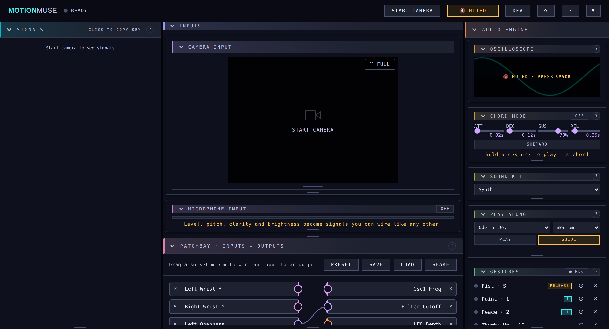

# ByteBard

A browser-based instrument that maps live webcam data — hand position, gesture, and body pose — to audio synthesis parameters in real time. No plugins, no install: pure Web APIs served as static files.

## Demo



<sub>Regenerate with `npm run screenshot` after a visible UI change.</sub>

Open `index.html` (or the Netlify deploy) and:
1. Click **START CAMERA** — MediaPipe loads and begins detecting hands and pose
2. Click **PRESET** — pick a starting patch (hands, face, gaze or whole-body)
3. Press **Space** (or click **🔇 MUTED**) to unmute, then move and play — the synthesiser
   is already running, it just starts silent

## Support

If ByteBard is useful to you, you can support its development — the **♥**
button in the app header links to:

- [GitHub Sponsors](https://github.com/sponsors/Dentarthurdent42)
- [Ko-fi](https://ko-fi.com/mathieu71673)
- [Buy Me a Coffee](https://buymeacoffee.com/dentarthurdent)

> **Maintainer setup** — to add or change a platform, edit `LINKS` in
> `src/ui/donate.js` (the in-app ♥ popover) and `.github/FUNDING.yml` (GitHub's
> Sponsor button). Both are plain lists of name → URL; the popover sizes itself
> to whatever is in it. GitHub Sponsors additionally requires
> [enrolling](https://github.com/sponsors).

## How it works

```
Webcam → MediaPipe (Hand + Pose) → Signal Bus → Mapper → Web Audio Engine
```

- **Signal Bus** (`src/bus.js`): a central `Map` of named signals (e.g. `hand_L_y`, `pinch_R`, `elbow_L`). Any source can `register` and `update` signals; any consumer can `norm`-alise them to 0–1.
- **Tracking toggles**: **✋ L**, **R ✋** and **🧍 POSE** in the header (once the camera is on) switch each model off outright. Hand tracking costs roughly twice what pose does and is normally the frame-rate bottleneck, so this is the bluntest lever available. With hands and pose both on the two models alternate frames; with one off, **the other runs every frame** rather than idling on its turn. Left and right are separate for a reason beyond cost: handedness is a **guess**, inferred from the hand's appearance, and a single hand at an odd angle gets mislabelled — silently swapping every signal it drives to the other side's keys. Enabling exactly one side skips the guess entirely (whatever is detected *is* that hand) and drops `numHands` to 1, so the landmark stage runs once. Dev mode's **MODELS** panel adds the pose model size and the `GPU`/`CPU` delegate, which applies to *both* models.
- **CV Source** (`src/cv.js`): runs MediaPipe `HandLandmarker` plus a swappable **pose backend** (`src/posebackends.js` — MediaPipe lite/full/heavy or TF.js MoveNet), extracts ~30 signals per frame, and writes them into the bus. Hand and pose inference **alternate frames** (each still ≥15 Hz at a 30 fps camera) so per-frame cost stays half of running both, and every positional signal passes through a per-signal **One-Euro filter** (`src/filter.js`, applied in `bus.update`) — the standard low-latency jitter filter: heavy smoothing on a held pose, light smoothing on fast moves.
- **Mapper** (`src/mapper.js`): each mapping takes one signal, applies a curve (linear, quad, cubic, log, sqrt, invert, invert+ease), scales it to an output range, and writes it to an audio parameter on every RAF tick. It's presented as a **node graph** (`src/ui/mapper-ui.js`) à la Blender geometry nodes / UE Blueprints: **input** signal nodes on the left, **output** parameter nodes on the right, joined by colour-coded bezier **cables**. Crucially each input is a single node whose one output socket **fans out** — reuse a signal by wiring it to as many parameters as you like; each parameter takes one incoming cable. Drag between two nodes to connect (or tap one, then the other) — the whole pill is a drag handle, sockets carry an oversized invisible tap target, and a release lands on the nearest eligible socket within a fingertip's radius, so wiring works with a thumb and not just a mouse. A cable's width/opacity pulses with its live value; range and curve stay hidden until you click a cable, and hovering a cable highlights it while dimming the rest, so wires stay easy to follow. Any cable can also be **inverted** with its `⇅ INVERT` toggle — the input's high end then drives the output's low end, which composes with (rather than replaces) the curve, so any response shape can run either way round. A cable can also be **quantised into N discrete levels** with its `steps` field (applied after the curve, so pair it with `log`/`quad` for perceptual spacing) — a stepped filter cutoff gives you a handful of definite timbres instead of a continuous smear. The **+ add input…** and **+ add output…** pickers keep their choices grouped by category (signal group / parameter section) rather than one flat list. Nodes stay put once placed: deleting a cable (its × in the editor) leaves both endpoint nodes on the canvas to be re-wired. An output also *remembers* its range, curve, steps and invert flag, so re-wiring a different input into it (or unplugging and re-plugging) doesn't reset them. Each node has its own × — placed on the pill's *outer* edge, opposite its socket, so a fat finger can't hit both — to remove it outright, so even a lone input/output pair can be disconnected or cleared. For **oscillator-frequency** cables the range editor grows a tone picker: a labeled piano keyboard, QWERTY playing (`A W S E D F T G Y H U J` = C…B, `Z`/`X` shift octave) while the editor is open, **−**/**+** semitone nudges, and min/max fields that accept note names (`A4`, `Db3`) as well as Hz — every pick is auditioned through the one-shot voice. **SET MIN** / **SET MAX** choose which endpoint the next pick sets, and the choice *stays put*: keep tapping or nudging to correct MIN until you explicitly press SET MAX. On narrow screens the keyboard renders wider than the panel and scrolls horizontally, so individual keys stay big enough to tap (a horizontal drag pans instead of picking).
- **Audio Engine** (`src/engine.js`): two oscillators through a BiquadFilter, and the chord-mode voice bank through a **second, independent filter and level** (`chord_filter_freq` / `chord_filter_q` / `chord_volume`, with `osc_volume` as the lead's counterpart) — the two sources converge into a shared convolution reverb and master gain. All driven by the Web Audio API with 25 ms parameter smoothing. **Volume is the exception**: it snaps onto a perceptual step ladder and fires *one* envelope per level change instead of re-smoothing every frame — see Volume quantisation below. Sliders carry **magnetic snap points** at musically meaningful values (½ volume, centre detune, unity Q…) marked by tick notches — drag near one and the thumb detents onto it; signal-driven (mapped) values are never snapped.
- **Scale quantiser** (`src/scale.js`): optionally snaps oscillator frequencies onto a musical scale, root and tuning system before they reach the engine.
- **Dynamics** (`src/dynamics.js`): the volume step ladder — equal-loudness (dB) levels, an exact-silence bottom rung, and the sticky rounding that keeps a jittery hand from chattering between levels.

## Starting muted

The synthesiser **starts with the page**, so every control in the audio panel is
live from the first paint — you can build a patch, set ranges and audition
nothing until you want to. The output is **muted on launch**, because a page
that makes noise at you before you've asked is hostile on a phone, in a shared
room, and most of all to someone who came to read about it.

Muted is shown three ways, because a silent instrument and a broken one look
identical otherwise:

- the header button reads **🔇 MUTED** in amber (**🔊 SOUND ON** when live);
- a **MUTED** banner sits over the visualiser;
- the waveform **keeps moving** behind that banner. The mute gain is placed
  *after* the analyser precisely so it does — you can see the instrument
  responding to your hands while it is silent.

Three ways to toggle it: the header button, **tapping the visualiser** (the
biggest thing on screen already showing the state), and **Spacebar**. The key
binding is shown, and changed, under **Mute Hotkey** in the audio panel: click
it, press the key you want, Esc cancels.

Two details worth knowing about the spacebar in particular. It's the key
browsers use to activate whatever has focus, so the app claims it — a focused
button keeps **Enter** but loses Space, which is the trade that makes the
shortcut behave the same way regardless of invisible focus state. And it is
never intercepted while you're typing in a field or working a `<select>`.

Mute state is deliberately **not remembered** between visits: "you unmuted last
time" isn't consent to make noise now, and it's one keypress to change.

Because the page builds an `AudioContext` without a user gesture, browsers hand
it back **suspended** — the graph exists and every control works, but the clock
is frozen until you interact. The first click, key or tap resumes it. The
gotcha, which cost one shipped bug: `AudioContext.resume()` does not *reject*
when permission is being withheld, it returns a promise that never settles, so
awaiting it before rendering leaves the audio panel permanently empty on every
browser that enforces the policy — and headless Chromium doesn't, so it passes
CI. `npm run test:launch` now forces the suspension and fails if that returns.

## Themes

Five: **Midnight** (default), **High Contrast**, **Ember** — dark; **Paper**
and **Sepia** — light. Picked in the audio panel, persisted, and applied before
first paint so there's no flash of the wrong palette.

Themes are pure CSS. Each is a `[data-theme]` block overriding the same colour
tokens; nothing else in the stylesheet knows a theme exists. The light themes
are not the dark palette inverted — an accent tuned to read on near-black is
invisible on near-white, so every accent is re-chosen rather than reused.

`npm run test:contrast` parses **every** theme's block and checks all of them:
75 pairs across 5 themes, worst 5.10:1 against a 4.5:1 threshold. Checking only
`:root` would have verified the default palette and let the other four ship
unreadable, which is exactly the trap a light theme sets.

## Sections: containers, scrolling and resizing

Every section — camera view, signals, models, patchbay, gestures, chord mode,
each audio block, the parameter sliders — is its own container: a bordered box
with a header strip, a body that can scroll on its own, and a **grip along the
bottom edge** to set its height. Drag the grip to resize, **double-click it to
fit the content** again. Heights persist per section.

So there are two levels of scrolling, which is the point: long lists (signals,
gestures, output sliders) scroll *inside* their section, and the sections
themselves scroll within their column. Pin the ones you're working with to the
size you want and page through the rest.

Sections start at their natural height with **no** scrollbar; only open-ended
lists get a default height. Giving every section a scroller by default would
trade one annoyance for a worse one. A section that *is* clipped fades at its
bottom edge, and the fade lifts when you reach the end — a 3px scrollbar is not
an affordance.

**Drag a section's header to reorder it** within its column. The order is
stored as ids, not as moved DOM nodes: the audio panel rebuilds its markup on
any structural change, which would discard a reordered DOM instantly, whereas a
stored order is simply re-applied. It survives a re-render and a reload.
Dragging *between* columns is deliberately not supported — landscape places
panels in explicit grid cells while portrait uses source order, so that would
have to rewrite two different layouts.

Each container also carries a **hue drawn from where it is on screen** — column
sets the base, vertical position walks it — so you can aim at a section without
reading its title. It's derived from measured geometry rather than declared per
section, because a hardcoded hue would lie the moment a section moved. It is
decoration only: no state is carried by colour, and the accent's lightness is a
per-theme token, because a stripe tuned for near-black grounds vanishes on
near-white.

This is applied at runtime (`src/ui/sections.js`) rather than baked into a
dozen template strings: each section already had the same shape — a header
followed by content — so a section added next week gets a container, a
scroller and a grip without anyone remembering to add them. `npm run
test:layout` fails the build if a section loses its body, its grip or its id.

The camera view resizes with its own handle instead, directly beneath it: it
has to keep an exact 4:3 box or the landmark overlay stops lining up with the
video, so that handle drags vertically but writes a *width* and lets the aspect
ratio set the height.

In **portrait** the camera also **sticks to the top** of the scroll, so you can
still see yourself — and the tracking overlay — while working the patchbay and
audio controls below it. This is an instrument you play by moving in front of a
camera; losing sight of the camera while reaching for a control is backwards.
The handle is there for when the height gets in the way.

## Starting patches (PRESET)

**PRESET** opens a menu of complete patches rather than loading one silently:

| Patch | Needs | What it does |
|---|---|---|
| **Hands** | camera | Left-hand height = pitch, right = second oscillator, pinch = volume |
| **Face · Brow & Mouth** | camera + FACE | Raise your eyebrows for pitch, open your mouth for volume |
| **Face · Expressive** | camera + FACE | Adds smile → filter, pucker → detune, cheek puff → reverb, head roll → osc mix |
| **Gaze · Look to Play** | camera + FACE + GAZE | Look left/right for pitch, up/down for tone, mouth for volume |
| **Pose · Whole Body** | camera | Stand back: arm height and torso lean drive everything |

Each entry lists what still has to be switched on, and picking one says so again
in the toast — a face patch with the camera off is otherwise just silence with
no explanation. Presets live in `PRESETS` (`src/mapper.js`) as plain data:
`[audioParam, signal, min, max, curve, steps, invert]` rows, so adding one is a
single array entry. A unit test checks every preset references a real parameter
and a real signal, with ranges inside each parameter's bounds, so a renamed
signal can't leave a dead patch in the menu.

## Pitch quantisation (scales & tuning)

By default the oscillators glide continuously. The **Pitch Quantize** panel
(top of the Audio Engine column) snaps both oscillator frequencies onto the
nearest note of a chosen **root**, **scale** and **tuning system**, so gestures
play *in key* instead of sliding microtonally.

- **Scales:** chromatic, major, natural/harmonic minor, dorian, phrygian,
  mixolydian, major/minor pentatonic, blues, whole-tone.
- **Tunings:** equal temperament (12-TET), just intonation (5-limit),
  Pythagorean. Tunings are defined as the 12 interval ratios from the root, and
  scales pick which degrees are playable — so any scale renders in any tuning
  (e.g. *C minor, just intonation* or *major pentatonic, Pythagorean*).

While quantisation is on, a **piano keyboard** under the selectors shows the
scale at a glance: in-scale notes are tinted (the root most strongly) and two
coloured dots mark where **osc 1** (purple) and **osc 2** (cyan) are currently
snapped, moving live as you play. The note readout beneath it is colour-matched
to the two dots. The toggle defaults to **OFF** (continuous), so existing
behaviour is unchanged until you opt in. Quantisation is applied centrally in
`engine.set()`, so it affects both signal-driven mappings and manual slider moves.

## Volume quantisation (steps, gate & articulation)

A continuous gesture → volume mapping is almost unplayable, and not for the
reason it looks like. Two things go wrong: the engine re-schedules a 25 ms gain
ramp *every frame*, so loudness never settles — it just glides toward a moving
target — and a hand never lands on exactly zero, so "quiet" is a persistent
low-level tone rather than silence. Together they mean notes can't be separated
or re-attacked.

The **Volume Quantize** panel (under Pitch Quantize) snaps the master gain onto
discrete levels, which is what fixes it *indirectly*: once the value is
quantised, changes become rare events, so the engine can fire **one envelope per
level change** and let it complete. The stepping is the enabler; the completed
envelope is the crisp attack you hear.

- **Levels** are spaced equally in **decibels**, not linear gain — hearing is
  logarithmic, so linear rungs would bunch every audible difference into the top
  of the range. The default 6 steps over −30 dB gives silence, −24, −18, −12,
  −6, 0 dB: exactly 6 dB apart.
- **GATE** makes the bottom level *true* silence (gain exactly 0), which is what
  makes a gap between notes possible at all. The select beside it says **where**
  the gate switches, as a share of full volume (`< 18%` = silent below 18 %).
  `·auto` is the ladder's own midpoint, which is a *derivation* rather than a
  preference: with **2 steps** the midpoint lands at −15 dB, so a linear cable
  flips off at 18 % of its travel when what an on/off control implies is
  halfway. Raise it to move the switch later — at 2 steps the top setting puts
  it at half of full scale. The dead band that stops chatter (2 dB) rides along
  with it, and full volume always opens the gate at every setting.
  The adjustment is deliberately bounded to the span between silence and the
  first audible level, so it can only ever move the gate — never silence levels
  that the slider's notches still advertise. That also means it does most of its
  work at coarse step counts: at the default 6 steps the whole range is
  3.8–5.5 %, because on a finer ladder the gate point *is* a fine detail.
- **PLUCK / KEY / BOW** set the attack and release at a level change. Dropping to
  silence gets its own, slower time so it reads as a damped release rather than a
  chop.
- Levels are **sticky** (hysteresis of ~⅓ of a step), so a shaky hand holding a
  level doesn't chatter between two rungs.
- The volume slider's tick notches show the actual levels, and the panel readout
  shows the live rung (`▁████▁ 5/6 · −6 dB`, or `SILENT`).

The **mapping curve matters** as much as the ladder. `pinch_R` reads 1 when the
fingers are together, so volume has to *fall* as it rises — open hand loud,
pinch muted. Plain `inv` would leave the silence level occupying a mere ~4 % of
finger travel, which is unhittable, so the default preset uses **`invquad`**
(invert then ease), widening it to ~20 %.
The gate sits *after* the reverb send, so closing it cuts the tail too — that's
deliberate: a 1.8 s tail spilling across the gap is the very smear the feature
exists to remove. Quantisation is applied centrally in `engine.set()`, so it
covers both gesture-driven writes and manual slider moves.

Measured with `npm run test:audio` (a noisy control signal that hovers near
closed, like a real hand), before → after:

| | before | after |
|---|---|---|
| gain changes while holding still | 29 | **0** |
| gain changes on a jittery hold | 61 | **0** |
| silence reached | **never** (−41 dB floor) | **233 ms** (true zero) |
| separable notes out of 4 | **0** | **4** |
| attack time | n/a | **33 ms** |

## Sound kits

The **Sound Kit** selector (top of the Audio Engine column) applies instrument
timbre presets — **Synth, Piano, Organ, Trumpet, Strings, Flute, Bass** — built
from custom harmonic waveforms, filter and effect settings on the synth engine
(synthesized approximations, not samples; zero downloads, works offline).
A kit sets where the timbre parameters *rest*; gesture mappings keep modulating
on top. Tweaking any waveform, filter or timbre slider flips the selector to
"Custom". The chosen kit is saved with presets. Kits live in `src/soundkit.js`;
custom waveforms are registered through `engine.defineWave()`.

## Guided tour (in-app tutorial)

First visit auto-offers a step-by-step tour of the whole app — camera, signals,
patchbay, presets, audio engine, quantisers, play-along, dev mode, gestures and
chords — as spotlight coach-marks over the live UI. The **?** button in the
header re-opens it any time; the app stays fully clickable during the tour, so
"click it now" actually works. Esc closes, ←/→ navigate; on phones the card
becomes a bottom sheet.

The tour is built for a project that changes weekly:

- **It's data.** Every step is one entry in `TOUR_STEPS`
  (`src/ui/tutorial.js`) — selector, title, two sentences. Adding, moving or
  retiring a feature means editing one array entry; the file header documents
  the exact workflow.
- **It can't silently rot.** `npm run test:tutorial` (run in CI on every PR)
  boots the app, enables every state steps declare they need, and **fails the
  build if any step points at UI that no longer exists**. At runtime a stale
  step is skipped gracefully instead — the app never breaks because the tour
  lagged a release.
- **Returning users see what's new.** Step ids are tracked per user; when a
  release ships steps you haven't seen, the **?** pulses ("tour updated — 2 new
  steps") instead of making you sit through the whole thing again.
- Steps whose feature needs a particular state (audio on, dev mode) simply
  don't show until the app is in it — the tour adapts to what's actually on
  screen.

## Developer mode

Most features are visible by default, but experimental / in-progress ones are
tucked behind the **DEV** toggle in the header (persisted). With dev mode off,
the **EEG/EMG** source tabs, the **◈ LiDAR** depth toggle, the **Gestures** and
**Chord Mode** sections, and the **Shader** panel are hidden (and chord playback
is disabled) — a deliberate
*progressive-disclosure* choice so newcomers meet a simpler surface. Turn DEV
on to reveal and use them. Lives in `src/devmode.js`; under-construction
elements carry a `.uc-feature` class hidden by CSS unless `<body class="dev">`.

## Shader — visual output

The **Shader** panel sits in the **patchbay** column, not the audio one: it is
driven by signals and mappings, so it belongs beside the wiring that feeds it
rather than among the synth's parameters. It renders a WebGL fragment shader (plasma / warp / bars)
that reacts to the live audio level and two signals you pick (default
`hand_R_x` / `hand_R_y`). It honors `prefers-reduced-motion` (freezes the time
term). `src/shader.js` is the renderer (one program, `u_mode` branch);
`src/ui/shader-ui.js` is the panel. The choice + driving signals save with
presets.

## Accessibility & colour (OKLab)

The palette is defined in **OKLab** (`oklch()` tokens in `css/main.css`).
OKLab's perceptually-uniform lightness makes contrast predictable, so every
text/accent token clears **WCAG AA (≥4.5:1)** on the panel ground — checked in
CI by `tests/contrast/index.js` (which parses `oklch()` and computes real sRGB
luminance). Accessibility is treated as both *perceptual* (contrast, visible
`:focus-visible` rings, `prefers-reduced-motion`) and *conceptual* (a clear
input→output mental model, progressive disclosure via dev mode, plain-language
labels, and icon **plus** text — never icon-only). Toggle controls expose
`aria-pressed`; canvases carry `aria-label`.

## Gestures & chord mode

The **Gestures** section recognizes hand poses and turns them into discrete
triggers. Thirteen built-in gestures ship ready to use — **fist, point, peace,
thumbs-up, open palm, rock horns**, plus the **ASL number handshapes** in their
own collapsed group — and **● REC** records your own: name it, hold the pose
during the 3-2-1 countdown, and it's captured (camera must be running).
Any gesture, built-in included, can be removed with its × (removals persist;
**RESTORE BUILT-IN GESTURES** brings the defaults back).

Every gesture is also exposed as a mappable bus signal `gesture_<id>`, so a
gesture can drive *any* audio parameter, not just chords.

### The feature vector

Recognition is nearest-template matching over twelve normalized hand features:
five finger extensions, openness, spread, how far the thumb is carried from the
palm, and the four thumb-to-fingertip contacts. The last five exist because the
number handshapes can't be represented without them — ASL 6/7/8/9 differ only in
*which* fingertip touches the thumb, and 2-vs-3 and 4-vs-5 only in whether the
thumb is tucked. Both are palm-normalised, so they don't change with hand size or
distance from the camera, and both are computed from image landmarks like every
other feature (world landmarks are optional in the MediaPipe result, and a
missing contact channel would read as a false touch).

Channels are **weighted**, because they aren't equally informative — measured
across the reference photos, `fingerExt`'s thumb moves over a 0.09 range in
total, so unweighted it would just add noise; the contacts, which carry the
number shapes, get the loudest vote. Each template also declares which channels
**define** its shape (a don't-care mask): where the thumb tip incidentally rests
against a fist's curled fingers varies hand to hand and is not what makes a
fist a fist, so the classics ignore the contact channels entirely, while
ASL 6–9 — which are *about* those contacts — care about all of them. Distance is
a weight-normalized RMS over the cared channels, so ranking stays fair between
7-channel and 12-channel templates.

The threshold is a *rejection* radius, not a separation guarantee: which
gesture wins is decided by nearest neighbour, and the value (0.20) sits at the
measured knee of the operating curve — under a live-hand degradation model
(compressed extensions, frame noise, spurious contacts) 99.6% of classic poses
are recognized and 0.2% misread, while only ~4% of relaxed non-gesture hands
slip under it per frame. `tests/unit/gesture-robust.test.js` drives the real
matcher through that model deterministically, so a template or threshold edit
that would regress live behaviour fails CI. Debounce does the rest — a new pose
must win two frames before it takes over, and a few dropped frames are
tolerated before release, so a borderline reading can't machine-gun chord mode.

### Calibration

`fist`, `point`, `peace` and `thumbs` are **measured**: MediaPipe run over the
reference photos in `tests/gesture-img/`, features read straight out of
`math.js`. The rest have no reference photo, so they're derived from a small
geometric model built on those same measurements and shipped flagged **`est`** —
good starting points, not ground truth. Hands differ, and 2-vs-3 in particular
depends on where *you* put your thumb.

**CALIBRATE** walks through every estimated shape in turn, prompting for the
pose and recording it from your own hand (⊙ on a row does just that one).
Calibrated templates replace the estimate in place, keeping the gesture's id — so
chord assignments and mappings survive — clear the `est` flag, and save with
presets.

`npm run test:gesture-img` runs the hand pipeline over the reference photos,
asserts each maps to the right gesture, and fails if a template edit pushes any
pair below the separation floor. Add `-- --calibrate` to print the measured
feature vectors, the whole template table and the sorted pairwise distances —
that output is where the measured templates come from. (Needs
`@mediapipe/tasks-vision`, a Chromium, and `hand_landmarker.task` in that folder.)

### Chord mode

**Chord Mode** maps gestures to chords **by scale degree in a key**, not by
absolute root. Pick a key once — root, mode, octave — and each gesture gets a
degree (**I ii iii IV V vi vii°**) plus an optional diatonic **7th**. Changing
the key transposes every assignment at once, and every chord is guaranteed to
belong to the key. With **FOLLOW** on (the default) the key comes from Pitch
Quantize, so chords land in the same key the melody snaps to; it stands down
automatically when quantise is off or its scale isn't one of the six seven-note
modes, since roman numerals mean nothing over a pentatonic or whole-tone scale.

Qualities and numerals are *derived*, never tabulated: stack every other scale
tone and read the intervals back. Harmonic minor therefore comes out
**i ii° III+ iv V vi° vii°** — leading tone and all — with no special cases.

Holding an assigned gesture sustains its chord; releasing it lets the chord go
(hold-to-sound). Chords play through a dedicated 4-voice bank with **its own
filter and level** — `Chord Cutoff` / `Chord Q` / `Chord Vol`, plus a **Chord
Filter Type** row — so the chord bed can sit darker or quieter than the lead
(or the other way round) without either touching the other. `Osc Vol` is the
lead's own level on the same footing. Both sources then share the reverb and
**Master Vol**, so the volume ladder and its silence gate still govern
everything — chords obey dynamics and go silent when the gate closes. The LFO
wobbles only the *lead* filter; for movement on the chord bed, map any signal
to `chord_filter_freq` in the patchbay. Custom
gestures, calibration and chord assignments are saved with presets. Logic:
`src/gesture.js` (recognizer), `src/chords.js` (chord construction + `diatonic()`),
`src/chordmode.js` (gesture→chord glue), with the voice bank in
`engine.playChord()` / `releaseChord()`.

## Fullscreen camera view

**⛶ FULL** (below the camera toggles) makes the camera view fullscreen — via
the native Fullscreen API where available, or a CSS takeover on iPhone Safari
(which has no element fullscreen). In fullscreen, **🎹 KEYS** overlays the live
pitch-quantise keyboard along the bottom of the view. Gesture overlays keep
their alignment at any screen shape.

## Play along (Guitar Hero mode)

The **Play Along** section starts a falling-note game: notes descend toward a
hit line above the piano keys, and you *hit* a note by steering osc 1's
quantised pitch onto the target as it crosses the line — using whatever gesture
drives `osc1_freq` (a Left-Wrist-Y mapping is added automatically if none
exists). Starting a song turns pitch quantise on in the song's key and restores
your tuning afterwards. A quiet **guide** melody can be toggled; hits and
misses get audio feedback.

**Scoring:** hits are timing-graded — **PERFECT** inside the central 40% of
the difficulty's window (150 pts, higher chirp, amber flash) vs **GOOD**
(100 pts), both plus a streak bonus of `10 × min(streak, 10)`; floating
PERFECT/GOOD/MISS text rises off the hit line. Songs end on a results screen:
a big **letter grade** from accuracy (S ≥ 95%, A ≥ 90%, B ≥ 75%, C ≥ 60%,
else D), score with a **★ NEW BEST** star when you beat your record, tier
counts and best streak. Best scores persist per song per difficulty in
`localStorage` (`bytebard-scores` — kept out of shareable preset files);
the panel shows the saved best for the selected song while idle. Quitting
mid-song discards the run.

- **Songs** (public domain, bundled in `src/songs.js`): Ode to Joy, Twinkle
  Twinkle, When the Saints, Scarborough Fair. Chart format:
  `{ bpm, beatsPerBar, root, scale, notes: [{ b, m, d }] }` — beat, MIDI note,
  duration in beats.
- **Difficulties:** *easy* (downbeats & long notes only, ±250 ms window,
  slow fall, octave-agnostic matching), *medium* (on-the-beat notes, ±180 ms),
  *hard* (every note, ±120 ms, fast fall).
- The game renders in the panel and — best experience — on the fullscreen
  overlay. Game logic: `src/playalong.js`; renderer: `src/ui/playalong-ui.js`.

## Saving & loading

**SAVE** (in the mapper toolbar) downloads the entire instrument — every
mapping plus all audio parameters, waveform/filter choices, the pitch-quantise
tuning, the volume-step configuration, and everything gesture-side (custom
recordings, hidden built-ins, calibrated templates, the chord key and its degree
assignments) — as a single `.json` file you can keep or share. **LOAD** restores
one. Chord assignments merge over the shipped defaults rather than replacing
them, so gestures added in a later version still arrive with a chord; assignments
saved in the old absolute `root + octave + quality` format migrate to the nearest
degree of the key.
The current session is also stored in `localStorage`, so your setup returns
automatically after a reload or PWA relaunch. Preset files and stored keys were
renamed with the ByteBard rebrand; files saved under the old name still load,
and existing settings, panel widths and high scores migrate across on first
read (`src/storage.js`). Serialisation lives in
`src/preset.js`; `engine.snapshot()`/`restore()` and `mapper.serialize()`/`load()`
own their respective slices of state.

## Available signals

| Key | Description |
|-----|-------------|
| `hand_L_x` / `hand_R_x` | Wrist X position (0 = left edge) |
| `hand_L_y` / `hand_R_y` | Wrist Y position (0 = bottom, 1 = top) |
| `hand_L_open` / `hand_R_open` | Hand openness (0 = fist, 1 = fully open) |
| `hand_L_spread` / `hand_R_spread` | Thumb-to-pinky spread |
| `pinch_L` / `pinch_R` | Pinch strength — 1 when the thumb and index tips are together, 0 with the hand open. World-space, so camera-independent |
| `finger_L_thumb` … `finger_R_pinky` | Individual finger extension (0–1) |
| `thumb_out_L` / `thumb_out_R` | How far the thumb is carried from the palm (0 = folded across it, 1 = clear) |
| `contact_L_index` … `contact_R_pinky` | Thumb-to-fingertip contact (1 = pads touching). Palm-normalised, and tight enough that a merely curled finger doesn't register — a thumb-to-pinky tap makes a clean discrete trigger |
| `elbow_L` / `elbow_R` | Elbow joint angle in degrees — **self-calibrating**: the observed per-user range (nobody's elbow reaches 0° or 180°) maps to the full control range once ≥25° of motion has been seen |
| `shoulder_y_L` / `shoulder_y_R` | Shoulder height |
| `shoulder_width` | Distance between shoulders |
| `arm_raise_L` / `arm_raise_R` | Arm raise (0 = down, 1 = fully raised) |
| `torso_tilt` | Lateral torso lean (−1 = left, +1 = right) |
| `head_x` / `head_y` | Nose position |
| `nose_y` | Raw nose Y (high = head dipped) |
| `hand_L_z` / `hand_R_z` | Hand **distance from camera** (0 = far, 1 = near) |
| `hand_dz` | Depth difference between hands (push one hand forward) |
| `body_z` | Torso distance from camera |
| `depth_near` | Nearest surface in the scene, in metres (LiDAR only) |
| `depth_center` | Depth at frame centre, in metres (LiDAR only) |
| `brow_raise` / `brow_furrow` / `brow_L` / `brow_R` | Eyebrow raise / furrow, per-side outer raise (FACE) |
| `mouth_open` / `smile` / `pucker` / `lips_funnel` | Lip & jaw shapes (FACE) |
| `tongue_out` | Tongue sticking out (FACE) |
| `cheek_puff` / `cheek_squint_L` / `cheek_squint_R` | Cheek shapes (FACE) |
| `ear_L_x/y` / `ear_R_x/y` | Tracked ear positions (FACE) |
| `head_yaw` / `head_roll` | Head orientation derived from the ears, −1..1 (FACE) |
| `gaze_x` / `gaze_y` | Pupil orientation, −1..1, subject's frame (GAZE) |

## Face & gaze tracking (opt-in)

Once the camera is running, two toggles appear under the LiDAR button:

- **☺ FACE** loads MediaPipe `FaceLandmarker` (with blendshapes) and publishes
  eyebrow, lip, tongue, cheek and ear signals. Ears don't articulate, so their
  tracked positions are exposed directly plus derived `head_yaw` / `head_roll`.
- **◉ GAZE** publishes pupil orientation as `gaze_x` / `gaze_y` (−1..1, in the
  subject's frame), drawn live as vectors on the iris.

Both are **off by default** and independent; either loads the shared face model
on first use (`src/face.js`, own detection loop and overlay — the hand/pose
pipeline is untouched). All face/gaze signals are registered up front, so they
can be mapped (and saved in presets) before tracking is enabled.

## Resizable panels

On desktop, drag the dividers between the three columns to resize them
(double-click a divider to reset). Widths persist across sessions. A narrow
window squeezes the columns down to fit, but only for display — your chosen
widths are kept and come back when there's room again.

## Desktop sizing

This is a dense, small-text control surface by design — great on a laptop,
cramped on a large monitor. Windows **≥1200px wide** get a deliberately larger
pass: text, paddings, sliders, node-graph sockets, piano keyboards and the
default side-panel widths all scale up together, via a single
`@media (min-width: 1200px)` block in `css/main.css` plus a matching
`src/ui/viewport.js` `isDesktop()` check for the handful of canvases (piano
keyboards, the game highway, the oscilloscope) that draw at a JS-specified
pixel size rather than reading their CSS box. Narrower windows — including the
`max-width: 768px` mobile layout — are completely unaffected.

## Optical depth inputs (LiDAR / ToF)

Out of the box, depth-from-camera is estimated monocularly from MediaPipe
landmarks — apparent hand size and shoulder span. It needs no extra hardware
and works with any webcam, but it is relative and scale-ambiguous.

For **true metric depth**, the `◈ LiDAR` toggle (top-right of the camera view)
opts into the [WebXR Depth Sensing API](https://immersive-web.github.io/depth-sensing/).
**Under construction:** the toggle is hidden unless **DEV** mode is on, and
turning DEV off ends a live depth session; the monocular estimate is always
available regardless. The API exposes the per-pixel depth map produced by an
optical depth sensor —
Apple's **LiDAR** on iOS AR-capable devices, or **ToF** cameras on ARCore
Android. When active, per-landmark depth is sampled directly from the depth map
and transparently replaces the monocular estimate behind the same `*_z` signal
keys, so existing mappings keep working — just more accurately, including in
low-texture and low-light scenes. Two extra metric signals (`depth_near`,
`depth_center`, in metres) are also published.

The toggle is feature-detected: it dims when `immersive-ar` + `depth-sensing`
is unavailable (e.g. desktop browsers, iOS Safari without WebXR), and the app
silently falls back to the monocular estimate. The pluggable backend lives in
`src/depth.js` — additional optical sources (stereo, depth webcams via a
`getUserMedia` depth track) can be added there behind the same signal keys.

## Adding a new signal source

1. In your source module, call `bus.register(key, { label, group, min, max, source })` for each signal in `init()`.
2. Call `bus.update(key, value)` each sample.
3. Call `bus.decay(key)` when the source is absent to fade signals smoothly to zero.

## Project structure

```
index.html          HTML skeleton
css/
  main.css          All styles (CSS variables, layout, components)
src/
  bus.js            Signal registry (adaptive calibration + One-Euro smoothing)
  filter.js         One-Euro low-latency jitter filter
  math.js           Geometry helpers (dist3, angles, openness, extension,
                    thumb-out and thumb-to-fingertip contact)
  engine.js         Web Audio API synthesiser
  scale.js          Scale + tuning pitch quantiser
  storage.js        Brand-prefixed localStorage + legacy-key migration
  dynamics.js       Volume step ladder (dB levels, silence gate, hysteresis)
  mapper.js         Signal → audio parameter routing and curves
  preset.js         Save/load of mappings + settings (file + localStorage)
  soundkit.js       Instrument timbre presets (synthesized)
  songs.js          Bundled play-along note charts
  playalong.js      Play-along game logic (scheduler, judging, difficulties)
  chords.js         Chord construction + diatonic degrees (I–vii in any mode)
  gesture.js        Weighted 12-feature gesture recognizer, built-in and ASL
                    templates, calibration store
  chordmode.js      Gesture → scale-degree chord mapping (hold-to-sound)
  devmode.js        Developer-mode toggle (gates under-construction features)
  shader.js         WebGL visual-output shader (reacts to audio + signals)
  cv.js             MediaPipe Hand + swappable pose source (latency HUD)
  posebackends.js   Pose backends: MediaPipe lite/full/heavy + TF.js MoveNet
  depth.js          Optical depth layer (monocular estimate + WebXR LiDAR/ToF)
  face.js           Opt-in face landmark + gaze tracking (blendshape signals)
  main.js           Event handlers and RAF entry point
  ui/
    status.js       Status dot and toast notifications
    resize.js       Draggable panel splitters (desktop)
    viewport.js     isDesktop() breakpoint check, shared with main.css
    fullscreen.js   Fullscreen camera view + keyboard overlay
    keyboard.js     Shared piano-keyboard renderer
    playalong-ui.js Falling-note highway renderer + game panel
    gesture-ui.js   Gestures + Chord Mode panel sections
    shader-ui.js    Shader visual-output panel section
    signals.js      Signal panel (build + live update)
    mapper-ui.js    Mapper rows (render + live bars)
    audio-ui.js     Audio panel (waveform buttons, sliders)
    model-ui.js     Dev-mode pose model comparison panel
    donate.js       Support/donations popover
    preset-menu.js  PRESET button → named starting-patch menu
    tutorial.js     Guided tour — TOUR_STEPS data + spotlight engine
    viz.js          Waveform oscilloscope canvas
    hotkeys.js      Keyboard shortcuts (mute, default Space) — rebindable,
                    persisted, and kept clear of typing
scripts/
  mobile-serve.mjs  Local HTTPS server for on-device (phone) testing
  screenshot.mjs    Regenerates docs/screenshot.png (npm run screenshot)
sw.js               Service worker (network-first app shell, cached MediaPipe models)
tests/
  unit/             node --test suites (chords, diatonic degrees, chord mode,
                    gesture matching + degradation robustness, judging, notes,
                    filter, dynamics, stepped volume, mapper steps, hotkeys)
  contrast/         WCAG contrast checks over the OKLab palette
  gesture-img/      Gesture recognition over reference photos (MediaPipe);
                    --calibrate prints vectors + pairwise template distances
  tutorial/         Tour staleness guard — fails CI if a step targets dead UI
  sw-freshness/     Proves a redeploy is visible on the very next load
  audio-launch/     Engine starts muted and usable against a *suspended*
                    AudioContext — the state real browsers give you and
                    headless Chromium does not
  pose-bench/       Synthetic 3D-mannequin pose-model benchmark
  audio-articulation/  Before/after articulation measurement (settling, gaps, attack)
  ui-ux/
    index.js        Playwright + Claude Vision UI/UX regression harness
    report.js       HTML report generator
```

## Running locally

No build step required. Serve the repo root over HTTP (ES modules require a server, not `file://`):

```bash
npx serve .
# or
python3 -m http.server 8080
```

Then open `http://localhost:8080`.

## Testing on mobile

The camera and the WebXR LiDAR depth path both require a **secure context**, so
a phone can't load the app over `http://<lan-ip>` — it needs HTTPS. Rather than
cutting a Netlify deploy preview for every change, serve the repo straight to
your phone over the local network:

```bash
npm run serve:mobile            # HTTPS on https://<your-lan-ip>:8443
npm run serve:mobile -- 9000    # …or a custom port
```

The script generates a self-signed certificate once (into `.cert/`, gitignored)
covering `localhost` and every LAN address, prints the URLs, and — if
`qrcode-terminal` is installed (`npm i -D qrcode-terminal`) — a scannable QR
code. Connect the phone to the **same Wi-Fi**, open the URL, and accept the
certificate warning once (Android Chrome: *Advanced → proceed*; iOS: install +
trust the profile under *Settings → General → VPN & Device Management*).

Notes:
- **WebXR LiDAR depth** needs **Android Chrome + ARCore**. iOS Safari has no
  WebXR, so on iPhone the `◈ LiDAR` toggle stays dimmed and the app falls back
  to the monocular depth estimate — the camera, hand/pose tracking and all
  other signals still work for on-device testing.
- For a **zero-warning trusted URL** (handy for iOS), tunnel the local server
  instead — e.g. `npx localtunnel --port 8443` or `cloudflared tunnel --url
  https://localhost:8443` — or host the static site on **GitHub Pages** for a
  stable HTTPS URL that scales without per-deploy limits.

## UI/UX tests

The test suite takes Playwright screenshots across four viewports and evaluates them with Claude Vision:

```bash
npm install
ANTHROPIC_API_KEY=sk-ant-… npm run test:ui
# open test-results/ui-ux-report.html
```

Without `ANTHROPIC_API_KEY` the screenshots are still saved but LLM evaluation is skipped (CI exits 0).

## Pose model comparison (dev mode)

With **DEV** on, a **MODELS** panel appears under the camera: pick the pose
backend — **MediaPipe Lite / Full / Heavy** (plus a GPU/CPU delegate switch)
or **TF.js MoveNet Lightning / Thunder** — and watch live detection FPS and
per-model mean/p95 inference times while the camera runs, so variants can be
A/B'd on the actual device. Switches happen live and persist in
`localStorage`. The **DELEGATE** switch applies to *both* the pose and hand
models, and **HANDS** sets the maximum hands tracked — the landmark stage runs
once per detected hand, so one hand is close to half the hand cost.

MoveNet loads TensorFlow.js lazily (only when selected) and adapts its 17 COCO
keypoints onto the BlazePose indices the pose signals read — all 12 pose
signals survive; hands always stay MediaPipe. It loads the **UMD** builds via
script tags rather than jsdelivr's `+esm` modules: the `+esm` transform of
these CommonJS packages produces cross-package imports that don't resolve
against each other, and the browser rejects the module at link time with
`SyntaxError: Importing binding name '…' is not found`. Backend abstraction:
`src/posebackends.js`; panel: `src/ui/model-ui.js`.

## Pose model benchmark

`npm run test:pose-bench` renders a procedural articulated 3D mannequin
(three.js) through a scripted 300-frame pose timeline — arms up/down, waves,
elbow bends, leans, ending in a 60-frame held T-pose — where every frame's
joint **world transforms are known** and projected to normalized image
coordinates as ground truth. Each backend then runs over the same frames and
is scored on:

- **latency** (mean / p95 wall-clock per frame),
- **accuracy** (per-joint error vs the known transform of each body part —
  mean / median / p95 over nose, shoulders, elbows, wrists, hips),
- **detection rate** (synthetic figures are harder than real people — this is
  a metric, not an assumption), and
- **jitter** (mean frame-to-frame drift of predicted joints while the figure
  holds perfectly still — the ground truth doesn't move at all).

Example run (headless CI container — "GPU" there is SwiftShader software
emulation, so real-GPU latencies will be far lower; error/jitter in
normalized image units ×1000, lower is better):

| backend       | detect % | lat mean | err median | jitter |
|---------------|---------:|---------:|-----------:|-------:|
| mp-lite (CPU) |      100 |    53 ms |        129 |    2.1 |
| mp-lite       |      100 |   315 ms |        129 |    1.8 |
| mp-full       |       86 |   538 ms |         57 |   74.4 |
| mp-heavy      |       92 |  1955 ms |        126 |    3.8 |

Reading it: **full** tracks the figure most tightly (half of lite's median
error) but was the least stable on the synthetic figure (dropouts + drift on
the held pose); **lite** detected every frame with the least jitter at a
fraction of heavy's cost — supporting lite as the shipping default.
MoveNet rows skipped in the sandboxed run (TF.js CDN unreachable there).

Results print as a table and land in `test-results/pose-bench.json`. Guidance:
**lite** for mobile / low-power (lowest latency), **full** when a desktop GPU
can afford ~2× lite's cost for tighter tracking, **heavy** only when accuracy
is critical and latency isn't, MoveNet **Lightning** as the low-latency
alternative if its jitter score wins on your device. Missing `.task` models
are fetched automatically; MoveNet rows skip when the TF.js CDN is
unreachable. Harness: `tests/pose-bench/`.

## Offline caching & getting updates

The service worker is **network-first for the app itself** and cache-first only
for the immutable MediaPipe wasm/model files. That ordering matters more than
it sounds: it was originally cache-first everywhere, which meant a returning
visitor always saw the *previous* deploy — open the site rarely enough and you
could sit several releases behind and reasonably conclude features had been
removed. Now what you load is what's deployed; the cache answers only when the
network fails or takes longer than 3.5 s, which is all the offline/PWA promise
actually needs. `npm run test:sw` proves it: it installs the worker, edits the
served files, reloads once, and fails if the new content doesn't appear (it
also fails if offline loading breaks). It runs in CI.

**Seeing a stale version anyway?** A previously-installed worker from before
this change can still be in charge. Reload once — that fetches the new
`sw.js`, which claims the page and clears the old caches. A private/incognito
tab (no worker, no cache) is the quickest way to confirm what the server is
actually serving.

## Hosting

No build step — serve the repo root as static files over HTTPS.

### Cloudflare Pages (recommended)

1. Go to [pages.cloudflare.com](https://pages.cloudflare.com), connect GitHub, select this repo
2. Build command: *(leave blank)*
3. Publish directory: `.`
4. Deploy — you'll get a free `*.pages.dev` URL

`_redirects` and `_headers` at the repo root are picked up automatically.

### GitHub Pages

Enable GitHub Pages in the repo settings (**Settings → Pages → GitHub Actions**). The included `.github/workflows/deploy.yml` deploys on every push to `main`. The site will be at `https://<user>.github.io/<repo>/`.

Note: GitHub Pages doesn't honour `_headers`, so the service worker is served without `Cache-Control: no-cache`. Chrome re-validates SW files by default regardless, so this is not a practical problem.

### Other static hosts (Render, Surge, etc.)

Serve the repo root. If the host supports Netlify-style redirect files, `_redirects` handles the SPA fallback and the legacy URL redirect automatically.

## Browser requirements

- Chromium 90+, Firefox 90+, Safari 15.4+ (WebGL required for MediaPipe GPU delegate)
- Camera permission required
- HTTPS or `localhost` required (getUserMedia restriction)
